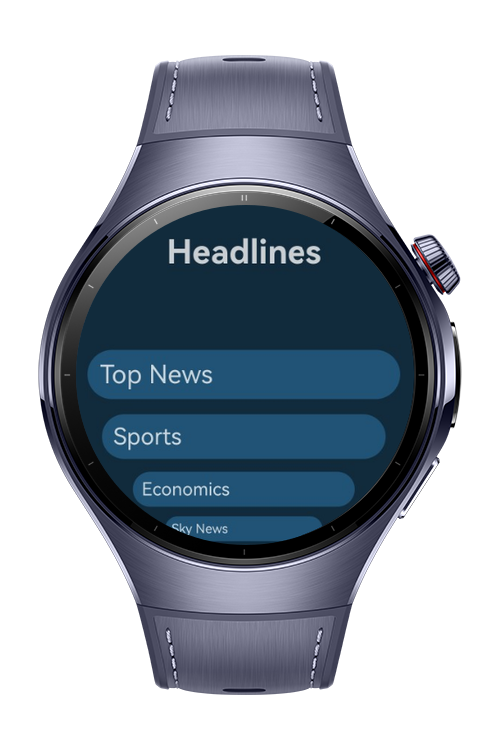
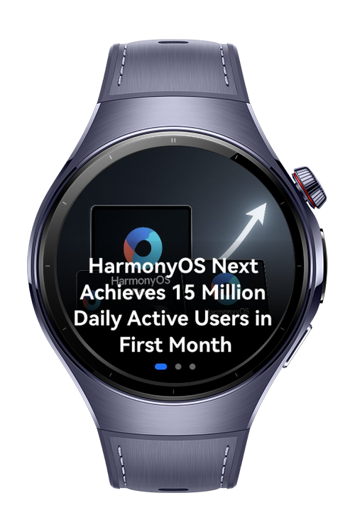

> **Note:** To access all shared projects, get information about environment setup, and view other guides, please visit [Explore-In-HMOS-Wearable Index](https://github.com/Explore-In-HMOS-Wearable/hmos-index).

# NewsSample

News Sample App lets users browse the latest news headlines and read full articles in a clean, minimal experience.

# Preview

<div>


</div>

# Use Cases

Displays a list of up-to-date news headlines on the home screen.

# Tech Stack

Languages: ArkTS
Frameworks: HarmonyOS SDK 5.1.0(18)
Tools: DevEco Studio Vers 5.1.0.820
Libraries: `@kit.ArkUI`

# Directory Structure

```
entry/src/main/ets/
|---entryability
|---|---EntryAbility
|---entrybackupability
|---|---EntryBackupAbility
|---pages
|---|---HeadlineFlow 
|---|---HomePage            
|---|---Index               
|---|---NewsItem               
|---|---Pages                              
```

# Constraints and Restrictions

## Supported Devices

- Huawei Watch 5

# LICENSE

NewsSample is distributed under the terms of the MIT License.
See the [LICENSE](/LICENSE) for more information.