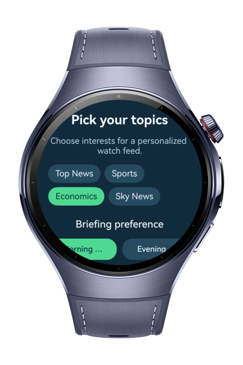
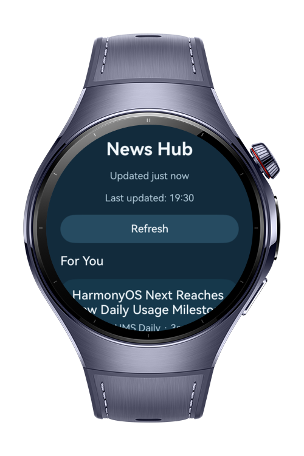
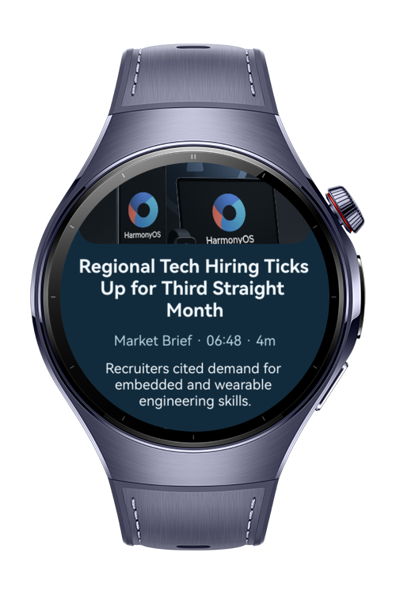
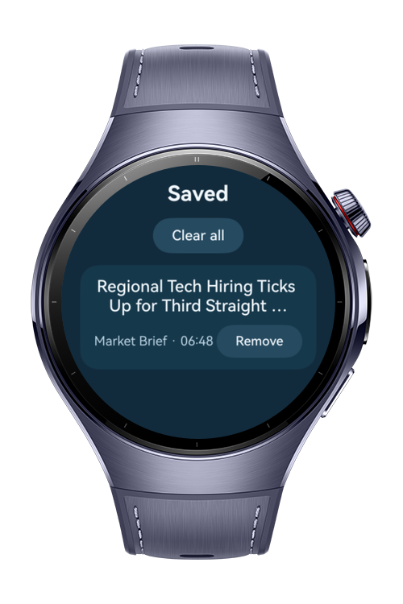

# NewsSample

News Sample is a HarmonyOS Next wearable news demo expanded into a richer watch-first product flow.

# Preview

<div>




</div>

# Use Cases

- First-run onboarding for topic interests and briefing preference.
- Personalized home hub with For You feed, topics, library shortcuts, refresh, and stale/offline state banners.
- Headline swipe flow with quick-save and article detail navigation.
- Article detail with summaries, tags, save/remove actions, and reading history tracking.
- Saved and history library screens with empty/loading/error polish.
- Daily briefing digest with reminder settings, notification readiness messaging, and test reminder action.
- Haptic feedback on key interactions.

# Feature Surface (Wearable Focus)

- Round-screen-friendly spacing and scrollability across major pages.
- Dark-theme-optimized card/chip/button contrast.
- Accessibility annotation for key tappable controls.
- Resource-backed user-visible copy for localization readiness.

# Tech Stack

Languages: ArkTS
Frameworks: HarmonyOS SDK 6.0.0(20)
Tools: DevEco Studio Vers 6
Libraries/Kits: `@kit.ArkUI`, `@kit.ArkData`, `@kit.NotificationKit`, `@kit.NetworkKit`

# Directory Structure

```
entry/src/main/ets/
|---entryability
|---|---EntryAbility
|---entrybackupability
|---|---EntryBackupAbility
|---components
|---data
|---models
|---pages
|---|---ArticleDetailPage
|---|---BriefingPage
|---|---HeadlineFlow
|---|---HistoryPage
|---|---HomePage
|---|---Index
|---|---OnboardingPage
|---|---Pages
|---|---SavedPage
|---|---SettingsPage
|---services
|---store
```

# Constraints and Restrictions

## Supported Devices

- Huawei Watch 5

# LICENSE

NewsSample is distributed under the terms of the MIT License.
See the [LICENSE](/LICENSE) for more information.
